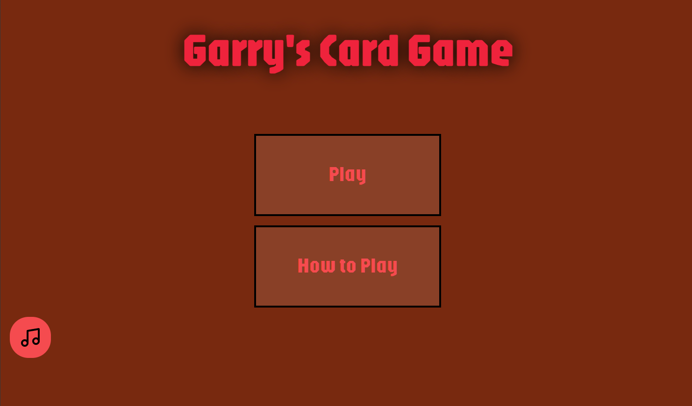
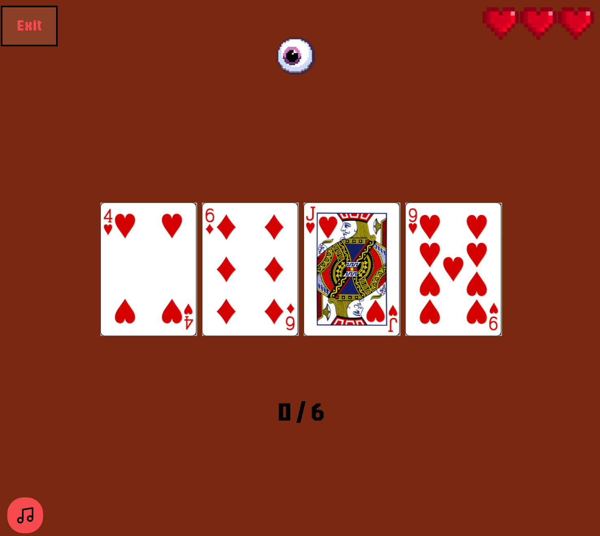

# Garry's Card Game

Card Memory game. The goal of this game is not to click the same card twice. This was created as part of The Odin Project curriculum.

official website:
- [Garry's Card Game](https://garryscardgame.netlify.app/) 

## In-Game screen

